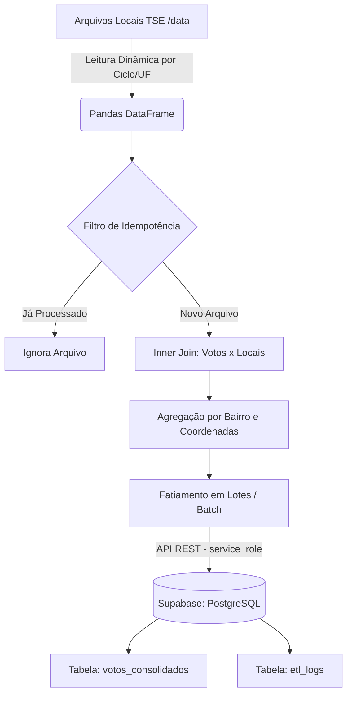

# Pipeline ETL - Geolocalização de Votos (TSE)

Pipeline de ingestão de dados "Local-First" desenvolvido para processar, agregar e cruzar dados históricos de eleições do Tribunal Superior Eleitoral (TSE), enviando os resultados otimizados para um banco de dados relacional na nuvem (Supabase/PostgreSQL).

## Arquitetura da Solução

O processo minimiza o uso de memória RAM (Data Slicing) e evita reprocessamentos desnecessários através de um controle rigoroso de idempotência.



## Decisões Arquiteturais

- **Local-First:** O cruzamento geográfico ocorre localmente, garantindo o controle total sobre a base nacional do TSE e evitando custos operacionais com APIs de nuvem para processamento bruto.
- **Idempotência por Arquivo:** O pipeline consulta a tabela `etl_logs` no Supabase antes de iniciar o processamento de uma UF. Isso previne duplicidade e desperdício computacional.
- **Batch Upload:** Inserção em lotes (2.000 registros por requisição) utilizando credencial `service_role` para contornar bloqueios de Row Level Security (RLS) e limites de payload HTTP.
- **Otimização de Índices:** O banco de dados possui índices nas colunas `ano_eleicao`, `cargo`, `numero_candidato`, `sigla_uf` e `municipio` para garantir respostas em milissegundos no front-end.

## Manutenção e Reprocessamento

Como o pipeline utiliza **Idempotência por Arquivo**, os estados já processados são ignorados automaticamente. Caso seja necessário reprocessar um estado ou ano específico devido a correções nos dados de origem, execute os seguintes passos no banco de dados (Supabase) antes de rodar o script novamente:

1. **Remova os dados consolidados do estado:**

   ```sql
   DELETE FROM votos_consolidados WHERE ano_eleicao = 2024 AND sigla_uf = 'RJ';
   ```

2. **Execute o pipeline novamente:**
   ```bash
   python pipeline/src/main.py
   ```

## Desempenho e Profiling

Resultados obtidos em ambiente local durante o processamento do ciclo eleitoral de 2024 (Estado do Rio de Janeiro):

- **Volume de Saída:** ~958.000 registros geográficos agregados.
- **Pico de RAM:** ~963 MB (Demonstrando a eficácia da agregação prévia).
- **Tempo de Execução:** ~9,4 minutos (Incluindo tempo de rede para upload via API).

## Estrutura de Diretórios

```text
pipeline_tse/
├── data/
│   ├── 2022/
│   │   ├── eleitorado_local_votacao_2022.csv
│   │   └── votacao_secao_2022_RJ.csv
│   └── 2024/
│       ├── eleitorado_local_votacao_2024.csv
│       └── votacao_secao_2024_RJ.csv
├── src/
│   └── main.py
├── .env
├── .gitignore
├── requirements.txt
└── README.md
```

## Como Executar

1. Instale as dependências: `pip install -r requirements.txt`
2. Configure as variáveis de ambiente no arquivo `.env`:
   ```env
   SUPABASE_URL=sua_url
   SUPABASE_KEY=sua_service_role_key
   ```
3. Execute o orquestrador: `python src/main.py`
